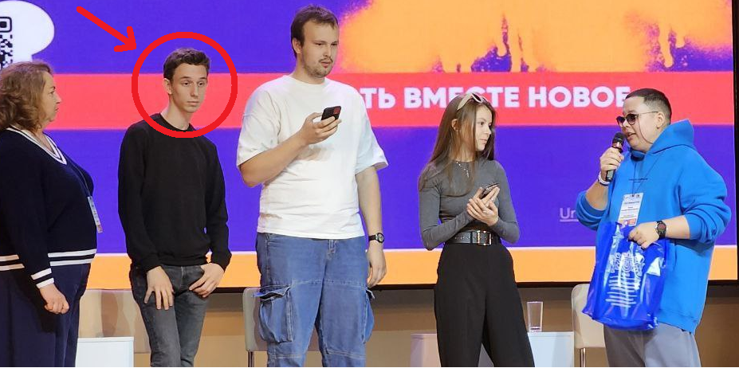

<!DOCTYPE html>
<html lang="ru">
<head>
    <meta charset="UTF-8">
    <title>ЗАПИСЬ С КАМЕР КАБИНЕТА 216</title>
    <a href="index.html"><link rel="icon" href="img/atmosphe.svg"></a>
    <link rel="stylesheet" type="text/css" href="styles.css">
</head>
<body>
    <header> 
        
        <h1>ЗАПИСЬ С КАМЕР КАБИНЕТА 216</h1>
        <nav>
            <a href="index.html">На главную</a>
        </nav>
    </header>

    

        <section id="about1">
            
            <h2>Преступление Кирилла Корниловича</h2>
            

                В руки наших журналитов оперативно попала запись с камер видонаблюдения из кабинета 216. На данном видеоматериале запечетлён момент, когда Кирилл Корнилович, выдающийся отличник, закинул контейнер из под сендвича за системный блок, предварительно туда харкнув, а после, покинул место преступления.
                 
                 Напомним, что на днях, он занял призовое место на квизе от Акселератора ЮУрГУ, чем удивил своих одногруппников и куратора. Поэтому поверить в сказанное выше, довольно трудно.
            

            
            

                Ниже представлен фрагмент видеозаписи за секунды до преступления. К сожалению, полностью показать запись мы не можем, так как кадры очень страшные.
            

            
            
        
            

                Но чтоже могло подтолкнуть его с совершению такого "свинского" поступка? Извините за терминологию.
                 
                 Скорее всего мотивом послужила незаслуженно маленькое кол-во поставленных отметок "5" на одной из пар Мистера Блинова, которая могла вызвать у Кирилла Корниловича девиантное поведение. Мы можем только гадать на эту тему, а истину, скорее всего, мы никогда не узнаем.
                 
                 Но после проведённых мер наказаний, Кирилла назначили патрулировать территории кибинета 216, чтобы сдавать нарушителей чистоты Андрею Вячеславовичу.
                 
                 Ниже представленна таблици со всей имеющеся информацией по этому делу.
            

            

                <table class=" table day-timetable" style="text-align:center;">
                    <tbody><tr style="background-color:#059600; color:#fff;">
                        <th class="table-col-l">Преступник</th>
                        <th class="table-col-r">Дата совершения преступления</th>
                        <th class="table-col-r">Предпологаемый мотив</th>
                        <th class="table-col-r">Меры пресечения</th>
                        <th class="table-col-r">Потерпевшие</th>
                    </tr>
                    <tr>
                        <td class="table-col-l"> Кирилл Корнилович</td>
                        <td class="table-col-r td_text_lesson"> 24.09.2024   </td>
                        <td class="table-col-r td_text_lesson"> Слишком маленькое кол-во поставленных отметок "5" за пару.   </td>
                        <td class="table-col-r td_text_lesson"> Объяснительная, воспитательный разговор, выговор, - реп от Андрея Вячеславовича.   </td>
                        <td class="table-col-r td_text_lesson"> Кабинет 216, Андрей Вячеславович Блинов, И-207 </td>
                    </tr>
                </table>
            

        </section>
    

    <footer>
        
© Морозов Демид Дмитриевич, 2024 г. Вы также можете найти меня <a href="https://www.inueco.ru/">здесь</a>...

        

            
            
        

    </footer>
</body>
</html>
